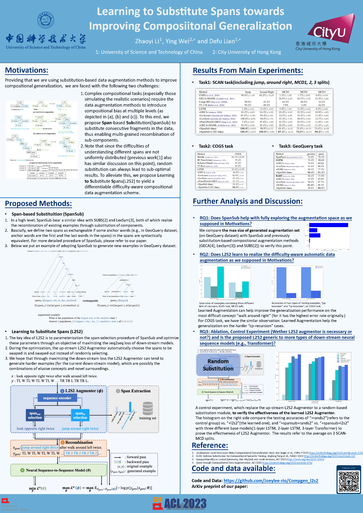

# L2S2: Learning to Substitute Spans towards Improving Compositional Generalization
Implementation of the paper "Learning to Substitute Span towards Improving Compositional Generalization"(https://arxiv.org/abs/2306.02840), Zhaoyi Li, Ying Wei and Defu Lian, ACL 2023 Main Conference (Oral), Toronto, Canada.


### 1.Introduction
This work introduces a novel composiitonal data augmentation method SpanSub to enable multi-grained sub-components recomposition, and a parameterized and differentiable data augmentation framework to encourage automatical recognition of hard compositions of elusive concepts and novel surroundings.
<div align="center">

</div>

### 2.Requirements and Environments
1. conda environment: refer to ''environment.yml'': ''conda env create -f timer.yml'';
2. download fairseq: https://github.com/facebookresearch/fairseq
### 4.Dataset
1. SCAN(ICML'18)(https://github.com/brendenlake/SCAN)
2. SCAN-MCD splits(ICLR'20)
3. COGS(EMNLP'20)(https://github.com/najoungkim/COGS)
4. GeoQuery(https://www.cs.utexas.edu/users/ml/nldata/geoquery.html, template split from ACL'18)

### 5.Experiments
#### 5.3: To reproduce GeoQuery result with BART-base
''experiments/geoquery/quick-reproduce/scripts''
```
cd l2s2
cp spansub/augmentation/geoquery/comp/* experiments/geoquery/quick-reproduce
cd experiments/geoquery/quick-reproduce
rm src.train
rm tgt.train
rename src_aug.train src.train
rename tgt_aug.train tgt.train
bash scripts/preprocess.sh
bash scripts/bpe.sh
bash scripts/bart_base_train.sh
bash scripts/pred_acc.sh # e.g., checkpoints at 9500 steps, acc = 89.72%
```
#### 5.1 SpanSub(e.g., COGS dataset)
```
cd /data2/home/zhaoyi/l2s2/spansub/augmentation/cogs
python cogs_aug.v2.py
```

#### 5.2: Learning to Substitute Spans(SCAN-MCD dataset)
```
cd experiments/scan-mcd/mcd1
python exp.sh
```


### 6.Acknowledgement
The code in this repository is partly based on the following baseline implementations: (Note that we've already cited all of the following papers in our paper.)
1. GECA(ACL'19) : https://github.com/jacobandreas/geca 
2. SUBS(NAACL'22) : https://github.com/SALT-NLP/SUBS 
3. MET-PRIM(EMNLP'22) : https://github.com/owenzx/met-primaug 
4. LexLearn(ACL'21) : https://github.com/ekinakyurek/lexical (For its SimpleAlign procedure)
5. Comp-Transformer(ACL'22) : https://github.com/google-research/google-research/tree/master/compositional_transformers (For Transforming COGS data to tree-form)
6. Besides, some parsers are adapted from OpenNMT(https://github.com/OpenNMT/OpenNMT-py) and Fairseq(https://github.com/pytorch/fairseq)

### 7.Cite this work
If you find this repo/paper useful for your research, please consider citing the paper:
```
@inproceedings{li-etal-2023-learning,
    title = "Learning to Substitute Spans towards Improving Compositional Generalization",
    author = "Li, Zhaoyi  and
      Wei, Ying  and
      Lian, Defu",
    editor = "Rogers, Anna  and
      Boyd-Graber, Jordan  and
      Okazaki, Naoaki",
    booktitle = "Proceedings of the 61st Annual Meeting of the Association for Computational Linguistics (Volume 1: Long Papers)",
    month = jul,
    year = "2023",
    address = "Toronto, Canada",
    publisher = "Association for Computational Linguistics",
    url = "https://aclanthology.org/2023.acl-long.157",
    doi = "10.18653/v1/2023.acl-long.157",
    pages = "2791--2811",
    abstract = "Despite the rising prevalence of neural sequence models, recent empirical evidences suggest their deficiency in compositional generalization. One of the current de-facto solutions to this problem is compositional data augmentation, aiming to incur additional compositional inductive bias. Nonetheless, the improvement offered by existing handcrafted augmentation strategies is limited when successful systematic generalization of neural sequence models requires multi-grained compositional bias (i.e., not limited to either lexical or structural biases only) or differentiation of training sequences in an imbalanced difficulty distribution. To address the two challenges, we first propose a novel compositional augmentation strategy dubbed Span Substitution (SpanSub) that enables multi-grained composition of substantial substructures in the whole training set. Over and above that, we introduce the Learning to Substitute Span (L2S2) framework which empowers the learning of span substitution probabilities in SpanSub in an end-to-end manner by maximizing the loss of neural sequence models, so as to outweigh those challenging compositions with elusive concepts and novel surroundings. Our empirical results on three standard compositional generalization benchmarks, including SCAN, COGS and GeoQuery (with an improvement of at most 66.5{\%}, 10.3{\%}, 1.2{\%}, respectively), demonstrate the superiority of SpanSub, L2S2 and their combination.",
}
```
### 8. P.S.
This repo is to be completed.

### Update: poster of our work at ACL'2023, Toronto, Canada.
<div align="center">

</div>

