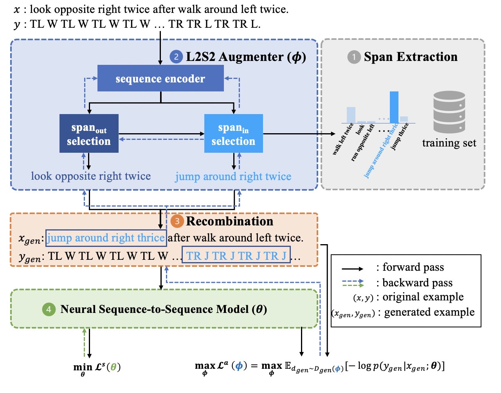

# L2S2: Learning to Substitute Spans towards Improving Compositional Generalization
Implementation of the paper "Learning to Substitute Span towards Improving Compositional Generalization", Zhaoyi Li, Ying Wei and Defu Lian, ACL 2023 Main Conference, Toronto, Canada.
### 1.Introduction
This work introduces a novel composiitonal data augmentation method SpanSub to enable multi-grained sub-components recomposition, and a parameterized and differentiable data augmentation framework to encourage automatical recognition of hard compositions of elusive concepts and novel surroundings.
<div align="center">

</div>

### 2.Requirements

### 3.Install the running environment

### 4.Experiments
#### 4.1: Run SpanSub on SCAN dataset

#### 4.2: Run L2S2 on SCAN-MCD dataset

#### 4.3: Reproduce SpanSub Results on COGS dataset

#### 4.4: Reproduce SpanSub Results on GeoQuery dataset

### 5.Acknowledgement
The code in this repository is partly based on the following baseline implementations: (Note that we've already cited all of the following papers in our paper.)
1. GECA(ACL'19) : https://github.com/jacobandreas/geca 
2. SUBS(NAACL'22) : https://github.com/SALT-NLP/SUBS 
3. MET-PRIM(EMNLP'22) : https://github.com/owenzx/met-primaug 
4. LexLearn(ACL'21) : https://github.com/ekinakyurek/lexical (For its SimpleAlign procedure)
5. Comp-Transformer(ACL'22) : https://github.com/google-research/google-research/tree/master/compositional_transformers (For Transforming COGS data to tree-form)
6. Besides, some parsers are adapted from OpenNMT(https://github.com/OpenNMT/OpenNMT-py) and Fairseq(https://github.com/pytorch/fairseq)

### 6.Cite this work
If you find this repo/paper useful for your research, please consider citing the paper:
```
bibtex of l2s2 paper
```
### 7. P.S.
This repo is to be completed.

### 7.Contact me
Hi, This repo may not cover all of the detailed procedures for the experiments you need to conduct. Feel free to email me (lizhaoyi777@mail.ustc.edu.cn) and I will try to help or give suggestions.
